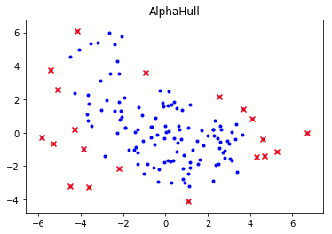
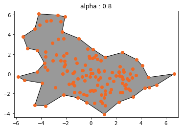
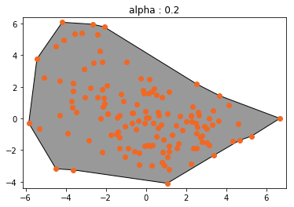
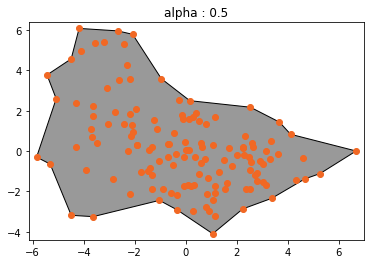
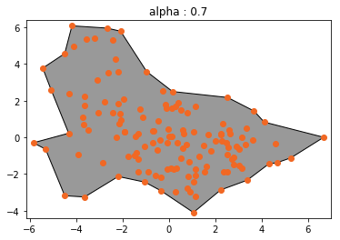
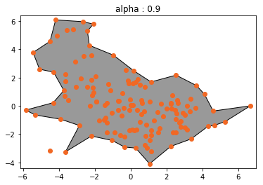
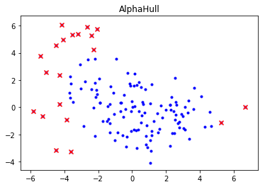
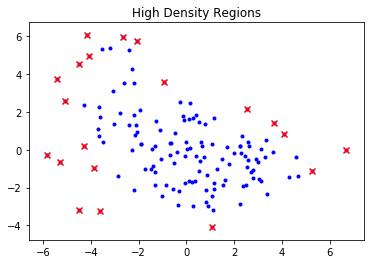
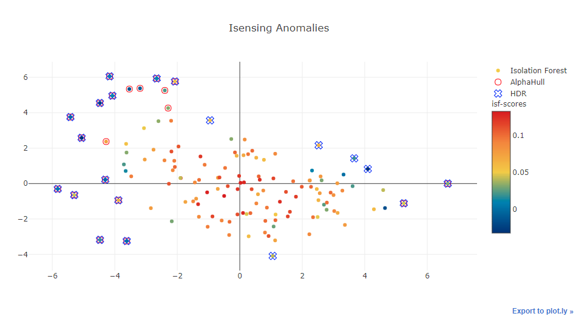

# Intelligent Sensing Toolbox Tutorial

This is the tutorial on how to use the Intelligent Sensing Toolbox (IST)

## Dataset

In this tutorial, we will be using **appliances-energy-prediction** dataset. This dataset is a time series data sampling at every 10 minutes for about 4.5 months.

The house temperature and humidity conditions were monitored with a ZigBee wireless sensor network. Each wireless node transmitted the temperature and humidity conditions around 3.3 min. Then, the wireless data was averaged for 10 minutes periods. The energy data was logged every 10 minutes with m-bus energy meters. Weather from the nearest airport weather station (Chievres Airport, Belgium) was downloaded from a public data set from Reliable Prognosis (rp5.ru), and merged together with the experimental data sets using the date and time column. Two random variables have been included in the data set for testing the regression models and to filter out non predictive attributes (parameters). 

For more information about the house, data collection, R scripts and figures, please refer to the paper and to the following github repository: 

https://github.com/LuisM78/Appliances-energy-prediction-data

Attribute Information:

| Feature Name | Descriptions | unit |
|-|-|-|
| Appliances | energy use | Wh 
| lights | energy use of light fixtures in the house | Wh 
| T1 | Temperature in kitchen area | °C 
| RH_1 | Humidity in kitchen area | % 
| T2 | Temperature in living room area | °C  
| RH_2 | Humidity in living room area | % 
| T3 | Temperature in laundry room area | °C  
| RH_3 | Humidity in laundry room area | % 
| T4 | Temperature in office room | °C  
| RH_4 | Humidity in office room | % 
| T5 | Temperature in bathroom | °C  
| RH_5 | Humidity in bathroom | % 
| T6 | Temperature outside the building (north side) | °C  
| RH_6 | Humidity outside the building (north side) | % 
| T7 | Temperature in ironing room  | °C  
| RH_7 | Humidity in ironing room | % 
| T8 | Temperature in teenager room 2 | °C  
| RH_8 | Humidity in teenager room 2 | % 
| T9 | Temperature in parents room | °C 
| RH_9 | Humidity in parents room | % 
| To | Temperature outside (from Chievres weather station) | °C  
| Pressure | Pressure from Chievres weather station | mm Hg 
| RH_out | Humidity outside (from Chievres weather station) | % 
| Wind speed | Wind speed from Chievres weather station | m/s 
| Visibility | Visibility from Chievres weather station | km 
| Tdewpoint | from Chievres weather station | °C 
| rv1 | Random variable 1 | nondimensional 
| rv2 | Random variable 2 | nondimensional


```python
%matplotlib inline
import pandas as pd

df = pd.read_csv('./energydata_complete.csv', index_col='date', parse_dates=[0])
df.head(3)
```


<div>
<style scoped>
    .dataframe tbody tr th:only-of-type {
        vertical-align: middle;
    }

    .dataframe tbody tr th {
        vertical-align: top;
    }

    .dataframe thead th {
        text-align: right;
    }
</style>
<table border="1" class="dataframe">
  <thead>
    <tr style="text-align: right;">
      <th></th>
      <th>Appliances</th>
      <th>lights</th>
      <th>T1</th>
      <th>RH_1</th>
      <th>T2</th>
      <th>RH_2</th>
      <th>T3</th>
      <th>RH_3</th>
      <th>T4</th>
      <th>RH_4</th>
      <th>...</th>
      <th>T9</th>
      <th>RH_9</th>
      <th>T_out</th>
      <th>Press_mm_hg</th>
      <th>RH_out</th>
      <th>Windspeed</th>
      <th>Visibility</th>
      <th>Tdewpoint</th>
      <th>rv1</th>
      <th>rv2</th>
    </tr>
    <tr>
      <th>date</th>
      <th></th>
      <th></th>
      <th></th>
      <th></th>
      <th></th>
      <th></th>
      <th></th>
      <th></th>
      <th></th>
      <th></th>
      <th></th>
      <th></th>
      <th></th>
      <th></th>
      <th></th>
      <th></th>
      <th></th>
      <th></th>
      <th></th>
      <th></th>
      <th></th>
    </tr>
  </thead>
  <tbody>
    <tr>
      <th>2016-01-11 17:00:00</th>
      <td>60</td>
      <td>30</td>
      <td>19.89</td>
      <td>47.596667</td>
      <td>19.2</td>
      <td>44.790000</td>
      <td>19.79</td>
      <td>44.730000</td>
      <td>19.000000</td>
      <td>45.566667</td>
      <td>...</td>
      <td>17.033333</td>
      <td>45.53</td>
      <td>6.600000</td>
      <td>733.5</td>
      <td>92.0</td>
      <td>7.000000</td>
      <td>63.000000</td>
      <td>5.3</td>
      <td>13.275433</td>
      <td>13.275433</td>
    </tr>
    <tr>
      <th>2016-01-11 17:10:00</th>
      <td>60</td>
      <td>30</td>
      <td>19.89</td>
      <td>46.693333</td>
      <td>19.2</td>
      <td>44.722500</td>
      <td>19.79</td>
      <td>44.790000</td>
      <td>19.000000</td>
      <td>45.992500</td>
      <td>...</td>
      <td>17.066667</td>
      <td>45.56</td>
      <td>6.483333</td>
      <td>733.6</td>
      <td>92.0</td>
      <td>6.666667</td>
      <td>59.166667</td>
      <td>5.2</td>
      <td>18.606195</td>
      <td>18.606195</td>
    </tr>
    <tr>
      <th>2016-01-11 17:20:00</th>
      <td>50</td>
      <td>30</td>
      <td>19.89</td>
      <td>46.300000</td>
      <td>19.2</td>
      <td>44.626667</td>
      <td>19.79</td>
      <td>44.933333</td>
      <td>18.926667</td>
      <td>45.890000</td>
      <td>...</td>
      <td>17.000000</td>
      <td>45.50</td>
      <td>6.366667</td>
      <td>733.7</td>
      <td>92.0</td>
      <td>6.333333</td>
      <td>55.333333</td>
      <td>5.1</td>
      <td>28.642668</td>
      <td>28.642668</td>
    </tr>
  </tbody>
</table>
<p>3 rows × 28 columns</p>
</div>


## Problem Formulation

In this tutorial, we are using Intelligent Sensing Toolbox to identify outliers in this appliances-energy-prediction dataset. We are going to transform and feature engineered daily time series data to a single data point for the anomaly detection.

## Features Selection

We are only using selected subset of data from the period of 2016-01-12 to 2016-05-26 with selected features as follows:

|#| Feature Name | Descriptions | unit |
|-|-|-|-|
|1| Appliances | energy use | Wh 
|2| lights | energy use of light fixtures in the house | Wh 
|3| T1 | Temperature in kitchen area | °C 
|4| RH_1 | Humidity in kitchen area | % 
|5| T2 | Temperature in living room area | °C  
|6| RH_2 | Humidity in living room area | % 
|7| T4 | Temperature in office room | °C  
|8| RH_4 | Humidity in office room | % 
|9| T6 | Temperature outside the building (north side) | °C  
|10| RH_6 | Humidity outside the building (north side) | % 
|11| To | Temperature outside (from Chievres weather station) | °C  
|12| RH_out | Humidity outside (from Chievres weather station) | % 


```python
start_period = '2016-01-12'
end_period = '2016-05-26'
mask = (df.index >= start_period) & (df.index < end_period)
df = df.loc[mask]
selected_ft = ["Appliances","lights","T1","RH_1","T2","RH_2","T4","RH_4","T6","RH_6","T_out","RH_out"]
df = df[selected_ft]
```

## Features Engineering

Intelligent Sensing Toolbox provides some functions for extracting features on time series data.

This functions are:
1. Multiple Regression - multiple_regression()
2. Fast Dynamic Time Warping - fast_DTW()
3. Pearsonr Correlation - pearsonr_correlation()

### 1. Multiple Regression

The multiple_regression() function performs mulitple regression on time series data and return their coefficients and intercept as features for our features extraction. 

Before calling the function, we first create a new feature named "total_energy" by summing up the total energy usage from both appliances & lights. Then we perform multiple regression on temperature & humidity to "fit" the total energy usage which allows us to know how much of the variation in total energy usage can be explained by the temperature & humidity of individual area inside or outside of the building (kitchen, living room, office room, etc) "as a whole", but also the "relative contribution" of each independent variable in explaining the variance.

The tutorial below demonstrates how to use multiple_regression() function with select features as follows:

- T1, Temperature in kitchen area, in Celsius 
- RH_1, Humidity in kitchen area, in % 
- T2, Temperature in living room area, in Celsius 
- RH_2, Humidity in living room area, in % 
- T4, Temperature in office room, in Celsius 
- RH_4, Humidity in office room, in % 
- total_energy, Total energy usage from Appliances & lights, in Wh


```python
df['total_energy'] = df['Appliances'] + df['lights']
df[['Appliances', 'lights', 'total_energy']].head(3)
```


<div>
<style scoped>
    .dataframe tbody tr th:only-of-type {
        vertical-align: middle;
    }

    .dataframe tbody tr th {
        vertical-align: top;
    }

    .dataframe thead th {
        text-align: right;
    }
</style>
<table border="1" class="dataframe">
  <thead>
    <tr style="text-align: right;">
      <th></th>
      <th>Appliances</th>
      <th>lights</th>
      <th>total_energy</th>
    </tr>
    <tr>
      <th>date</th>
      <th></th>
      <th></th>
      <th></th>
    </tr>
  </thead>
  <tbody>
    <tr>
      <th>2016-01-12 00:00:00</th>
      <td>40</td>
      <td>10</td>
      <td>50</td>
    </tr>
    <tr>
      <th>2016-01-12 00:10:00</th>
      <td>30</td>
      <td>20</td>
      <td>50</td>
    </tr>
    <tr>
      <th>2016-01-12 00:20:00</th>
      <td>40</td>
      <td>20</td>
      <td>60</td>
    </tr>
  </tbody>
</table>
</div>


Next, create the features using IST multiple_regression() on all temperature & humidity to "fit" total energy usage in daily basis (per day)


```python
from sklearn.preprocessing import StandardScaler
from isensing.features_extraction import multiple_regression

def apply_multiple_regression(df):
    df = df[["T1","RH_1","T2","RH_2","T4","RH_4","total_energy"]]
    values = StandardScaler().fit_transform(df)
    X = values[:, :-1]
    y = values[:, -1]
    coef = multiple_regression(X, y)
    return pd.Series(coef)

regression = df.groupby(pd.Grouper(freq='D')).apply(apply_multiple_regression)
regression.columns = ["coef_T1","coef_RH_1","coef_T2","coef_RH_2","coef_T4","coef_RH_4","coef_intercept"]
regression.head(3)
```


<div>
<style scoped>
    .dataframe tbody tr th:only-of-type {
        vertical-align: middle;
    }

    .dataframe tbody tr th {
        vertical-align: top;
    }

    .dataframe thead th {
        text-align: right;
    }
</style>
<table border="1" class="dataframe">
  <thead>
    <tr style="text-align: right;">
      <th></th>
      <th>coef_T1</th>
      <th>coef_RH_1</th>
      <th>coef_T2</th>
      <th>coef_RH_2</th>
      <th>coef_T4</th>
      <th>coef_RH_4</th>
      <th>coef_intercept</th>
    </tr>
    <tr>
      <th>date</th>
      <th></th>
      <th></th>
      <th></th>
      <th></th>
      <th></th>
      <th></th>
      <th></th>
    </tr>
  </thead>
  <tbody>
    <tr>
      <th>2016-01-12</th>
      <td>1.392645</td>
      <td>0.296293</td>
      <td>-1.523641</td>
      <td>-0.791488</td>
      <td>-0.127713</td>
      <td>0.848493</td>
      <td>-4.428581e-15</td>
    </tr>
    <tr>
      <th>2016-01-13</th>
      <td>-0.026371</td>
      <td>0.199427</td>
      <td>0.201833</td>
      <td>-0.173109</td>
      <td>-0.042660</td>
      <td>-0.125815</td>
      <td>2.156769e-16</td>
    </tr>
    <tr>
      <th>2016-01-14</th>
      <td>-4.602183</td>
      <td>0.199526</td>
      <td>4.129257</td>
      <td>-0.311668</td>
      <td>0.114736</td>
      <td>0.274699</td>
      <td>-9.564377e-15</td>
    </tr>
  </tbody>
</table>
</div>


### 2. Fast Dynamic Time Warping

Dynamic time warping (DTW) is one of the algorithms for measuring distance between two temporal sequences in time series analysis. The two time series in the algorithm may vary in speed. For example, the distance in walking could be detected using DTW, even if one person was walking faster than the other, or if there were accelerations and decelerations during the course of an observation.

Intelligent Sensing Toolbox uses Python implementation of Fast Dynamic Time Warping (FastDTW) that calculates the distances between two time series and they could be in different length.

Reference: https://github.com/slaypni/fastdtw

The tutorial below demonstrates Intelligent Sensing Toolbox fast_DTW() function:
- dtw distance between T6 & T_out
- dtw distance between RH_6 & RH_out 

*Note: Large value indicates there is a huge distance between two time series.*


```python
from isensing.features_extraction import fast_DTW

def apply_fast_dtw(df):
    temp = fast_DTW(df['T6'], df['T_out'])
    humd = fast_DTW(df['RH_6'], df['RH_out'])
    return pd.Series([temp, humd])

fast_dtw = df.groupby(pd.Grouper(freq='D')).apply(apply_fast_dtw)
fast_dtw.columns = ["dtw_outside_temp","dtw_outside_humd"]
fast_dtw.head(3)
```


<div>
<style scoped>
    .dataframe tbody tr th:only-of-type {
        vertical-align: middle;
    }

    .dataframe tbody tr th {
        vertical-align: top;
    }

    .dataframe thead th {
        text-align: right;
    }
</style>
<table border="1" class="dataframe">
  <thead>
    <tr style="text-align: right;">
      <th></th>
      <th>dtw_outside_temp</th>
      <th>dtw_outside_humd</th>
    </tr>
    <tr>
      <th>date</th>
      <th></th>
      <th></th>
    </tr>
  </thead>
  <tbody>
    <tr>
      <th>2016-01-12</th>
      <td>24.404167</td>
      <td>144.259167</td>
    </tr>
    <tr>
      <th>2016-01-13</th>
      <td>63.940000</td>
      <td>278.141667</td>
    </tr>
    <tr>
      <th>2016-01-14</th>
      <td>33.047500</td>
      <td>241.010000</td>
    </tr>
  </tbody>
</table>
</div>


### 3. Pearsonr Correlation

In statistics, the Pearson correlation coefficient also referred to as Pearson's r, is a measure of the linear correlation between two variables X and Y. It has a value between +1 and −1, where 1 is total positive linear correlation, 0 is no linear correlation, and −1 is total negative linear correlation.

In Intelligent Sensing Toolbox, it was implemented to measure how two time series are correlated with each other. The pearsonr_correlation() functions calculates the Pearsonr Correlation coefficients between two time series.

The tutorial below demonstrates Intelligent Sensing Toolbox pearsonr_correlation() function:
- correlation between between T6 & T_out
- correlation between between RH_6 & RH_out 

*Note: Both time series must be in the **same** length*


```python
from isensing.features_extraction import pearsonr_correlation

def apply_correlation(df):
    cor_temp = pearsonr_correlation(df['T6'], df['T_out'])
    cor_humd = pearsonr_correlation(df['RH_6'], df['RH_out'])
    return pd.Series([cor_temp, cor_humd])
    
correlations = df.groupby(pd.Grouper(freq='D')).apply(apply_correlation)
correlations.columns = ["cor_outside_temp","cor_outside_humd"]
correlations.head(3)
```


<div>
<style scoped>
    .dataframe tbody tr th:only-of-type {
        vertical-align: middle;
    }

    .dataframe tbody tr th {
        vertical-align: top;
    }

    .dataframe thead th {
        text-align: right;
    }
</style>
<table border="1" class="dataframe">
  <thead>
    <tr style="text-align: right;">
      <th></th>
      <th>cor_outside_temp</th>
      <th>cor_outside_humd</th>
    </tr>
    <tr>
      <th>date</th>
      <th></th>
      <th></th>
    </tr>
  </thead>
  <tbody>
    <tr>
      <th>2016-01-12</th>
      <td>0.926162</td>
      <td>0.839546</td>
    </tr>
    <tr>
      <th>2016-01-13</th>
      <td>0.968359</td>
      <td>0.909566</td>
    </tr>
    <tr>
      <th>2016-01-14</th>
      <td>0.867864</td>
      <td>0.834269</td>
    </tr>
  </tbody>
</table>
</div>


### Mean & Variance (Additional Features)

Additional features on the time series using simple statistic methods such as mean & variance.


```python
def apply_mean_var(df):
    df = df[df.columns[:-1]]
    val = list()
    for c in df.columns:
        val.append(df[c].mean())
        val.append(df[c].var())
    return pd.Series(val)

mean_var = df.groupby(pd.Grouper(freq='D')).apply(apply_mean_var)
mean_var_col = list()
for c in df.columns[:-1]:
    mean_var_col.append("mean_"+c)
    mean_var_col.append("var_"+c)

mean_var.columns = mean_var_col
mean_var.head(3)
```


<div>
<style scoped>
    .dataframe tbody tr th:only-of-type {
        vertical-align: middle;
    }

    .dataframe tbody tr th {
        vertical-align: top;
    }

    .dataframe thead th {
        text-align: right;
    }
</style>
<table border="1" class="dataframe">
  <thead>
    <tr style="text-align: right;">
      <th></th>
      <th>mean_Appliances</th>
      <th>var_Appliances</th>
      <th>mean_lights</th>
      <th>var_lights</th>
      <th>mean_T1</th>
      <th>var_T1</th>
      <th>mean_RH_1</th>
      <th>var_RH_1</th>
      <th>mean_T2</th>
      <th>var_T2</th>
      <th>...</th>
      <th>mean_RH_4</th>
      <th>var_RH_4</th>
      <th>mean_T6</th>
      <th>var_T6</th>
      <th>mean_RH_6</th>
      <th>var_RH_6</th>
      <th>mean_T_out</th>
      <th>var_T_out</th>
      <th>mean_RH_out</th>
      <th>var_RH_out</th>
    </tr>
    <tr>
      <th>date</th>
      <th></th>
      <th></th>
      <th></th>
      <th></th>
      <th></th>
      <th></th>
      <th></th>
      <th></th>
      <th></th>
      <th></th>
      <th></th>
      <th></th>
      <th></th>
      <th></th>
      <th></th>
      <th></th>
      <th></th>
      <th></th>
      <th></th>
      <th></th>
      <th></th>
    </tr>
  </thead>
  <tbody>
    <tr>
      <th>2016-01-12</th>
      <td>85.694444</td>
      <td>9300.213675</td>
      <td>4.236111</td>
      <td>77.734071</td>
      <td>20.092326</td>
      <td>0.154726</td>
      <td>45.142014</td>
      <td>2.785645</td>
      <td>19.307655</td>
      <td>0.211494</td>
      <td>...</td>
      <td>44.556840</td>
      <td>2.671823</td>
      <td>5.350388</td>
      <td>1.003739</td>
      <td>89.505330</td>
      <td>45.911326</td>
      <td>5.566319</td>
      <td>0.704427</td>
      <td>87.500000</td>
      <td>31.514763</td>
    </tr>
    <tr>
      <th>2016-01-13</th>
      <td>97.013889</td>
      <td>10419.692113</td>
      <td>5.416667</td>
      <td>79.545455</td>
      <td>19.197824</td>
      <td>0.053032</td>
      <td>42.867772</td>
      <td>2.202720</td>
      <td>18.568513</td>
      <td>0.086660</td>
      <td>...</td>
      <td>42.315174</td>
      <td>2.594407</td>
      <td>4.979861</td>
      <td>3.666789</td>
      <td>75.684838</td>
      <td>125.544736</td>
      <td>4.856944</td>
      <td>1.375157</td>
      <td>83.406250</td>
      <td>61.111390</td>
    </tr>
    <tr>
      <th>2016-01-14</th>
      <td>151.388889</td>
      <td>30872.183372</td>
      <td>5.000000</td>
      <td>57.342657</td>
      <td>20.372078</td>
      <td>3.187412</td>
      <td>42.435191</td>
      <td>2.542999</td>
      <td>19.743131</td>
      <td>2.863928</td>
      <td>...</td>
      <td>43.231053</td>
      <td>2.757366</td>
      <td>3.492367</td>
      <td>1.147251</td>
      <td>86.199664</td>
      <td>108.510760</td>
      <td>3.431944</td>
      <td>1.172531</td>
      <td>86.420139</td>
      <td>51.483282</td>
    </tr>
  </tbody>
</table>
<p>3 rows × 24 columns</p>
</div>


Lastly, combine all created features into one big features Dataframe


```python
features = pd.concat([regression, fast_dtw, correlations, mean_var], axis=1, sort=False)
features.index = [i.to_pydatetime().strftime("%d-%m-%Y") for i in list(features.index)]
```

## Features Decomposition

Intelligent Sensing Toolbox (IST) provides a dimensionality reduction algorithm called Robust Principal Component Analysis (RobustPCA). This implementation uses the algorithm from Croux and Ruiz-Gazen (JMVA, 2005), a fast algorithm for Robust Principal Components based on Projection Pursuit.

The tutorial below demonstrates dimensions reduction using IST RobustPCA algorithm


```python
from sklearn.preprocessing import StandardScaler
from isensing.decomposition import RobustPCA

values = StandardScaler().fit_transform(features)

rpca = RobustPCA(n_components=2)
rpca_values = rpca.fit_transform(values)

print("First five rows of reduced features\n\n%s\n" % rpca_values[:5])
print("Original data has the shape of ", features.values.shape)
print("New reduced data has the shape of ", rpca_values.shape)
```

    First five rows of reduced features
    
    [[ 0.82089744 -2.11437502]
     [ 1.5420456  -1.86439543]
     [ 3.62429763 -0.14692218]
     [ 2.56882845 -0.54620055]
     [ 3.14320091 -1.66198163]]
    
    Original data has the shape of  (135, 35)
    New reduced data has the shape of  (135, 2)
    

The RobustPCA also allows extracting its Principle Components by calling its attribute (*components_*) 


```python
rpca_princomp = rpca.components_
print("The principle components: \n\n%s\n" % rpca_princomp)
print("With the shape of ", rpca_princomp.shape)
```

    The principle components: 
    
    [[-0.21505842  0.00752105  0.18077324  0.04244263 -0.05538749  0.04499085
       0.00988795  0.07363679 -0.17307993  0.12150109 -0.47892912  0.09370553
       0.13574052  0.09779682  0.17501959 -0.30987378  0.08106612 -0.06665541
       0.02149424 -0.21355976 -0.02918285 -0.09597168 -0.08903045 -0.25894341
       0.27170071 -0.04716513 -0.048418   -0.25514285 -0.02496459  0.2015998
      -0.15382351 -0.27654025 -0.04486552  0.13429932 -0.15498606]
     [-0.00816654  0.03284153 -0.13179009 -0.18504552  0.12217617  0.19866802
       0.10122477 -0.03778885  0.11821143  0.08652275 -0.10337208  0.04637765
       0.00580793 -0.15968465 -0.1497088  -0.11258088  0.21595905 -0.15359597
       0.02103253 -0.03280008  0.41935136 -0.2132298   0.23093653 -0.11716519
       0.24632871 -0.12510587 -0.03617385 -0.04752411  0.16947439 -0.14808565
       0.23483422 -0.05416551  0.2423241  -0.16200883  0.39055169]]
    
    With the shape of  (2, 35)
    

## Anomaly Detection

Anomaly detection, also know as outlier detection, is the discovery of observations which are suspicions by having significantly differences from the majority of the data. Anomalies are often referred to as outliers, novelties, noise, deviations and exceptions.

Intelligent Sensing Toolbox (IST) provides two algorithms for detecting anomalies in an multivariate dataset. 

These algorithms are:
1. AlphaHull
2. High Density Regions (HDR)

### AlphaHull

AlphaHull first computes the alpha-shape or concave hull of a 2-dimensional data based on given alpha value then the outliers are identified when their distance are far away from the alpha-shape. The computation of the alpha-shape is based on delaunay triangulation.

The tutorial below demonstrates anomaly detection using IST AlphaHull algorithm and the result is the [x,y] coordinate of the outliers in 2-dimensional space.

*Note: AlphaHull only works with 2-dimensional space data*


```python
from isensing.anomaly import AlphaHull

alh = AlphaHull(n=20)
outliers = alh.fit(rpca_values, plot_outliers=True)
```





AlphaHull allows plotting the computed alpha-shape using its function plot_alpha_shape().


```python
alh.plot_alpha_shape()
print("The default 'alpha' value is {:.2f}".format(alh.alpha))
```

    The default 'alpha' value is 0.80
    





Different alpha results in different alpha-shapes. Larger alpha will have smaller areas in the computed alpha-shapes.


```python
for a in [0.2, 0.5, 0.7, 0.9]:
    alh = AlphaHull(alpha=a)
    alh.fit(rpca_values)
    alh.plot_alpha_shape()
```














### High Density Regions (HDR)

Another anomaly detection algorithm provided in Intelligent Sensing Toolbox (IST) is the High Density Regions (HDR). This algorithm computes the representation of a kernel-density estimate using Gaussian kernels then detects the outliers in that sparse regions (far away from the dense regions).

The tutorial below demonstrates anomaly detection using IST HDR algorithm and the result is the [x,y] coordinate of the outliers in 2-dimensional space.

Note: HDR only works with 2-dimensional space data


```python
from isensing.anomaly import HDR

hdr = HDR(n=20)
outliers = hdr.fit(rpca_values, plot_outliers=True)
```


### Outlier Detection

As both AlphaHull and HDR algorithms require the input data to be in 2-dimensional space, one could use dimension reduction techniques such as Principle Component Analysis (PCA) or Intelligent Sensing Toolbox's RobustPCA to reduce the dimensionality before using the algorithms to detect outliers. 

Intelligent Sensing Toolbox provides a wrapper function called ***outlier_detection()*** that helps to execute AlphaHull or HDR algorithms in a less complex manner. It is a 'pipeline' like function that does normalization, dimension reduction (RobustPCA or PCA) before applying either AlphaHull or HDR and returns the outlier indices. The function is also able to return the principle components and the errors of each features belonging to the anomalies. The output of the algorithm is a Python dictionary that contains the outlier indices, errors and principle components.

The following codes below demonstrates anomaly detections using ***outlier_detection()*** on both algorithms.


```python
from isensing.anomaly import outlier_detection

# Alpha-Hull
alpha_results = outlier_detection(features, 20, method='alpha', ret_errors=True, plot=True)
```





```python
# High-Density Region
hdr_results = outlier_detection(features, 20, method='hdr', ret_errors=True, plot=True)
```





### Isensing Anomalies

Isensing Anomalies (isensing_anomalies) is an ensemble algorithm that uses three algorithms, Isolation Forest, AlphaHull and HDR, to perform outliers detection. Only anomalies that are detected by all three algorithm are return as the results.

Using plotly scatterplot API, Isensing Anomalies is able to plot the data in a 2-dimensional space with the outilers marked by the individual algorithm. The colorbar indicates the outlier scores computed using Isolation Forest. The darker colors (blue) indicates the data has a higher probability to be an outlier and it is usually a negative value. The hovertext on each data point shows the data index, Isolation Forest's score and top 3 features error.

For example:
 > ***08-02-2016 : 0.0417 | cor_outside_temp : 4.9361 | coef_RH_2 : 1.6459 | mean_lights : 1.6108***
 
> **08-02-2016 : 0.0417** - Identified outlier index with Isolation Forest outlier scores (lower scores indicates higher outlier probability) <br>
> **cor_outside_temp : 4.9361** - Highest reconstructed error and its feature <br>
> **coef_RH_2 : 1.6459** - Second highest reconstructed error and its feature <br>
> **mean_lights : 1.6108** - Third highest reconstructed error and its feature <br>

High reconstructed error might indicates that particular feature caused the data point to be an anomaly.


```python
from isensing.anomaly import isensing_anomalies

anomalies = isensing_anomalies(features, 20, ret_errors=True, plot=True, ipynb=True)
```



    Isolation Forest:
    ['21-01-2016', '23-01-2016', '24-01-2016', '20-02-2016', '20-04-2016', '03-05-2016', '04-05-2016', '05-05-2016', '07-05-2016', '08-05-2016', '09-05-2016', '11-05-2016', '13-05-2016', '22-05-2016']
    
    AlphaHull:
    ['03-05-2016', '20-04-2016', '01-05-2016', '11-05-2016', '05-05-2016', '08-05-2016', '04-05-2016', '10-05-2016', '06-05-2016', '07-05-2016', '20-01-2016', '12-05-2016', '02-05-2016', '22-05-2016', '13-05-2016', '18-04-2016', '18-01-2016', '23-05-2016', '09-05-2016', '19-05-2016']
    
    High Density Regions:
    ['20-01-2016', '10-05-2016', '22-05-2016', '11-05-2016', '08-05-2016', '12-05-2016', '29-02-2016', '07-05-2016', '01-05-2016', '03-05-2016', '23-05-2016', '02-02-2016', '13-05-2016', '30-01-2016', '20-04-2016', '28-04-2016', '09-05-2016', '06-05-2016', '18-01-2016', '24-01-2016']
    
    All 3:
    ['13-05-2016', '11-05-2016', '09-05-2016', '08-05-2016', '03-05-2016', '07-05-2016', '20-04-2016', '22-05-2016']
    
    

The output of the algorithm is a Python dictionary that contains the outlier indices and the errors.


```python
print("The identified anomalies are:\n",anomalies['outliers'])
```

    The identified anomalies are:
     ['13-05-2016', '11-05-2016', '09-05-2016', '08-05-2016', '03-05-2016', '07-05-2016', '20-04-2016', '22-05-2016']
    


```python
print(anomalies['errors'][:3])
```

                 coef_T1  coef_RH_1   coef_T2  coef_RH_2   coef_T4  coef_RH_4  \
    12-01-2016  1.673329   0.125003  1.493688   0.602491  0.194869   1.463139   
    13-01-2016  0.506716   0.026409  0.402649   0.110837  0.332570   0.020762   
    14-01-2016  3.299883   0.098066  2.152116   0.011076  0.475910   0.122330   
    
                coef_intercept  dtw_outside_temp  dtw_outside_humd  \
    12-01-2016        0.370005          1.147418          0.959524   
    13-01-2016        0.288791          0.303980          0.813790   
    14-01-2016        1.360294          1.085112          0.671098   
    
                cor_outside_temp     ...      mean_RH_4  var_RH_4   mean_T6  \
    12-01-2016          0.086108     ...       1.120956  0.410580  0.375609   
    13-01-2016          0.623453     ...       0.645937  0.417861  0.254452   
    14-01-2016          1.315598     ...       1.178505  0.657065  0.059125   
    
                  var_T6  mean_RH_6  var_RH_6  mean_T_out  var_T_out  mean_RH_out  \
    12-01-2016  0.606221   0.763672  0.279305    0.269048   0.334319     0.397557   
    13-01-2016  0.368688   0.158498  0.252538    0.212421   0.266748     0.109821   
    14-01-2016  0.854582   0.371949  0.067190    0.141483   0.617221     0.220993   
    
                var_RH_out  
    12-01-2016    0.006501  
    13-01-2016    0.277862  
    14-01-2016    0.152583  
    
    [3 rows x 35 columns]
    
